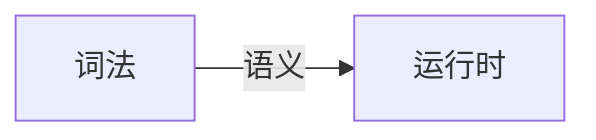

# 学习笔记

## 1. js语言通识 | 泛用语言分类方法

- 乔姆斯基谱系：是计算机科学中刻画形式文法表达能力的一个分类谱系，是由诺姆·乔姆斯基于 1956 年提出的。它包括四个层次：
  - 0- 型文法（无限制文法或短语结构文法）包括所有的文法。
  - 1- 型文法（上下文相关文法）生成上下文相关语言。
  - 2- 型文法（上下文无关文法）生成上下文无关语言。
  - 3- 型文法（正规文法）生成正则语言。（ragular）

一种上下包含的文法

---

### 语言按语法分类

- 非形式语言
  - 中文，英文
- 形式语言（乔姆斯基谱系）

## 2. js语言通识 | 什么是产生式

>- 产生式： 在计算机中指 Tiger 编译器将源程序经过词法分析（Lexical Analysis）和语法分析（Syntax Analysis）后得到的一系列符合文法规则（Backus-Naur Form，BNF）的语句
>- [巴科斯诺尔范式](https://zh.wikipedia.org/wiki/%E5%B7%B4%E7%A7%91%E6%96%AF%E8%8C%83%E5%BC%8F)：即巴科斯范式（英语：Backus Normal Form，缩写为 BNF）是一种用于表示上下文无关文法的语言，上下文无关文法描述了一类形式语言。它是由约翰·巴科斯（John Backus）和彼得·诺尔（Peter Naur）首先引入的用来描述计算机语言语法的符号集。
>- 终结符： 最终在代码中出现的字符（ https://zh.wikipedia.org/wiki/ 終結符與非終結符)

---

### 产生式（BNF）

- 用尖括号括起来的名称来表示语法结构名
- 语法结构分成基础结构和需要用其他语法结构定义的复合结构
  - 基础结构称终结符
  - 复合结构称非终结符
- 引号和中间的字符表示终结符
- 可以有括号
- `*` 表示重复多次
- `|` 表示或
- `+` 表示至少一次

---
四则运算：

- 1 + 2 * 3

**终结符：**

- Number
- `+ - * /`

**非终结符：**

- MultiplicativeExpression
- AddtiveExpression

```BNF
<MultiplicativeExpression>::=<Number>|
    <MultiplicativeExpression>"*"<Number>|
    <MultiplicativeExpression>"/"<Number>|
<AddtiveExpression>::=<MultiplicativeExpression>|
    <AddtiveExpression>"+"<MultiplicativeExpression>|
    <AddtiveExpression>"-"<MultiplicativeExpression>|
```

带括号的四则运算产生式

```BNF
<PrimaryExpression>::= <Number> | "("<AddtiveExpression>")"|
<AddtiveExpression>::=<MultiplicativeExpression>|
    <AddtiveExpression>"+"<MultiplicativeExpression>|
    <AddtiveExpression>"-"<MultiplicativeExpression>|
<MultiplicativeExpression>::=<PrimaryExpression>|
    <MultiplicativeExpression>"*"<PrimaryExpression>
    <MultiplicativeExpression>"/"<PrimaryExpression>
```

## 3. js语言通识 | 深入理解产生式

### 通过产生式理解乔姆斯基谱系

- 0型 无限制文法
  - ?::=?
- 1型 上下文相关文法
  - `?<A>?::=?<B>?`
- 2型 上下文无关文法
  - `<A>::=?`
- 3型 正则文法
  - `<A>::=<A>?`
  - `<A>::=?<A>` ×  不允许 A 出现在尾部

```js
{
    get a { return 1},
    get: 1
}

2 ** 1 ** 2  // 右结合，一般来说 js是上下文无关文法
```

严格意义上来讲， js 是上下文相关文法

---
其他产生式

> EBNF ABNF Customized

// js 里面产生式例子

```EBNF
AdditiveExpression :
    MultiplicativeExpression
    AddtiveExpression +
MultiplicativeExpression
    AdditiveExpression -
MultiplicativeExpression
```

## 4. js语言通识 | 现代语言的分类

### 现代语言的特例

- C++中，* 可能表示乘号或者指针，具体是哪个，取决于星号前面的标识符是否被声明为类型
- Python 中，行首的tab符和空格会根据上一行的行首空白以一定规则被处理成虚拟终结符indent或者 dedent(非形式语言)
- JavaScript中，`/` 号可能是除号，也可能是正则表达式开头，处理方式类似于VB，字符串模板中也需要特殊处理 `}`，还有自动插入分号规则

### 语言的分类

- 形式语言——用途
  - 数据描述语言
        `JSON, HTML, XAML, SQL, CSS`
  - 编程语言
        `C, C++, Java, C#, Python, Ruby, Perl, Lisp, T-SQL, Clojure, Haskell, JavaScript`

- 形式语言——表达方式
  - 声明式语言 `JSON, HTML, XAML, SQL, CSS, Lisp, Clojure, Haskell`
  - 命令式语言 `C，C++, Java, C#, Python, Ruby, Perl`

## 5. js语言通识 | 编程语言的性质

- [图灵完备性](https://zh.wikipedia.org/wiki/%E5%9C%96%E9%9D%88%E5%AE%8C%E5%82%99%E6%80%A7)：在可计算性理论里，如果一系列操作数据的规则（如指令集、编程语言、细胞自动机）可以用来模拟单带图灵机，那么它是图灵完全的。这个词源于引入图灵机概念的数学家艾伦·图灵。虽然图灵机会受到储存能力的物理限制，图灵完全性通常指“具有无限存储能力的通用物理机器或编程语言”。
- [图灵机（Turing machine）](https://zh.wikipedia.org/wiki/%E5%9B%BE%E7%81%B5%E6%9C%BA)：又称确定型图灵机，是英国数学家艾伦·图灵于 1936 年提出的一种将人的计算行为抽象掉的数学逻辑机，其更抽象的意义为一种计算模型，可以看作等价于任何有限逻辑数学过程的终极强大逻辑机器。
- 静态和动态语言： https://www.cnblogs.com/raind/p/8551791.html
- 强类型： 无隐式转换
- 弱类型： 有隐式转换
- 协变与逆变： https://jkchao.github.io/typescript-book-chinese/tips/covarianceAndContravariance.html

---

### 图灵完备性

- 图灵完备性
  - 命令式——图灵机
    - goto
    - if 和 while
  - 声明式——lambda
    - 递归

### 动态与静态

- 动态：
  - 在用户的设备/在线服务器上
  - 产品实际运行时
  - Runtime
- 静态
  - 在程序员的设备上
  - 产品开发时
  - Compiletime （编译时）

### 类型系统

- 动态类型系统与静态类型系统
- 强调型与弱类型
  - String + Number
  - String == Boolean
- 复合类型
  - 结构体
  - 函数签名
- 子类型
- 泛型
  - 逆变/协变

```js
{
    a: T1
    b: T2
}
```

```js
(T1, T2) => T3
```

```text
凡是能用 Array<Parent>的地方，
都能用Array<Child> (逆变)

凡是能用Function<Child>的地方，
都能用Function<Parent> （协变）
```

## 6. js语言通识 | 一般命令式编程语言的设计方式

### 一般命令式编程语言

|Atom| Expression | Statement | Structure | Program |
| - | - | - | - | - |
| Identifier | Atom | Expression | Function | Program |
| Literal | Operator | Keyword | Class | Module |
| | Punctuator | Punctuator | Process | Package |
| | | | Namespace | Library |
| | | | ...... | |

### 重学 JavaScript



## 7. js类型 | Number

## 8. js类型 | String

对其认知可能只是停留在感性的层面

- Character
- Code Point 用数字来表示字符
- Encoding

编码方式：

- ASCII
- Unicode
- UCS
  0000~FFFF
- GB
  - GB2312
    第一个版本，有部分 Code Point 与unicode 不一致，不兼容
  - GBK(GB13000)
    以为够用
  - GB18030
    包含几乎所有字符
- ISO-8859
  类似于在ASCII兼容，没有中文版本
- BIG5
  台湾

### Encoding

- UTF

UTF8  01100001 01100010
      |--a---| |---b---|
UTF16 00000000 01100001 00000000 01100010
      |-------a-------| |-------b-------|

### Grammar

"abc"
'abc'
`abc`

写一段 JS 的函数，把一个 string 它代表的字节给它转换出来，用 UTF8 对 string 进行遍码。

```javascript
const utf8_encoding = str => {
    let code = encodeURI(str);
    let list = [];
    let i = 0;
    while(i < code.length) {
        if(code[i] === '%') {
            list.push(parseInt(code[i+1] + code[i+2], 16));
            i += 3;
        } else {
            list.push(code[i].charCodeAt());
            i++
        }
    }

    let binaryList = []
    for(const i of list) {
        binaryList.push(i.toString(2));
    }
    return binaryList;
}
```

## 9. js类型 | 其他类型

- Boolean
  - true
  - false
- null
- undefined
- void 0

## 10. js类型 | 对象的基础知识

我们不应该收到语言描述的干扰
在设计对象的状态和行为时，我们重视遵循“行为改变状态”的原则

对象的行为必须是改变对象状态的，违背了这个原则，其实对象的内聚性就没有了

## 11. js类型 | js中的对象

在 js 运行时，原生对象的描述方式非常简单，我们只需要关心原型和属性两个部分。

js 用属性来统一抽象对象状态和行为。

一般来说，数据属性用于描述状态，访问器属性则用于描述行为。

数据属性中如果存储函数，也可以用于描述行为。

enumerable 主要影响 Object.keys() 这样的一些内置的函数的行为，也会影响 forEach 这样的语法产生的默认的行为。

当我们访问属性时，如果当前对象没有，则会沿着原型找原型对象是否有此名称的属性，而原型对象还可能有原型，因此，会有“原型链这一说法”。

这一算法保证了，每个对象只需要描述自己和原型的区别即可。

### Object API/Grammar

- {} . [] Object.defineProperty
- Object.create / Object.setPrototypeOf / Object.getPrototypeOf
  基于原型的对象 API
- new / class / extends
  基于分类的方式描述对象
  从语法上来看，是完全基于类的方式
- new / function / prototype
  不要用

js 中还有一些特殊的对象，比如函数对象。

除了一般对象的属性和原型，函数对象还有一个行为`[[call]]`。

用js中的function 关键字、箭头运算符或者 Function 构造器创建的对象，会有`[[call]]`这个行为。

用类似 f() 这样的语法把对象当作函数调用时，会访问到`[[call]]`这个行为

如果对应的对象没有 `[[call]]` 行为，则会报错

---

Q: 找出 JavaScript 标准里面所有具有特殊行为的对象
A: 数组，原型，字符串
